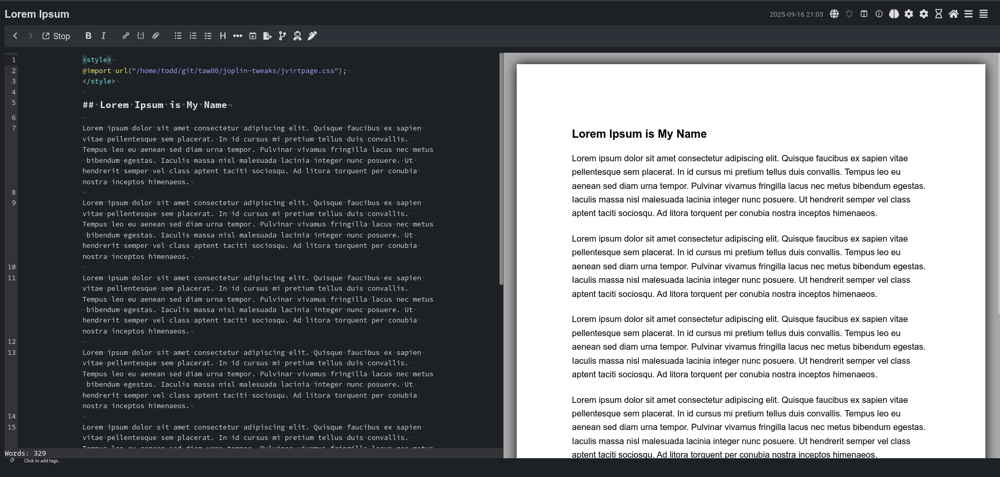
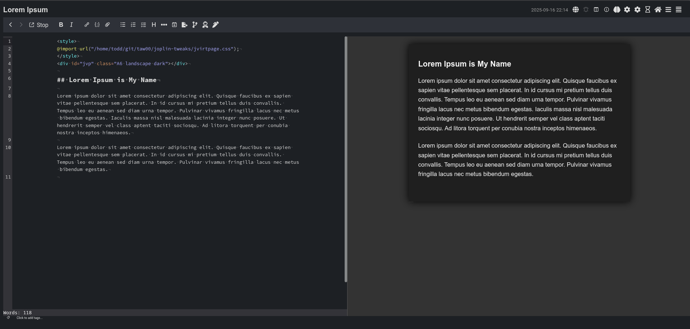

# joplin-tweaks

Style customizations for [Joplin](https://joplinapp.org/), a secure
open-source, notebook application.

Included in this repository are snippets of CSS that customize the look and
feel of the Joplin UI, its markdown previewer, and how documents are presented
in Joplin Cloud.

&ZeroWidthSpace;

&ZeroWidthSpace;

> ### Table of Tweaks
> 
> #### [Tweaks for the Markdown Previewer & Joplin Cloud](#tweaks-renderer-md)
> 
> - Render Jopin note preview as an [attractive virtual page](#jvirtpagecss)
> - snippet (exported note): exported notes [should not include scrollbars](#noscrollbars)
> - snippet (exported note): [remove excess spaced framing](#noframe) of exported content
> - snippet (exported note): [remove automated note titles](#notitle) from exported note
> 
> #### [Tweaks for the Joplin UI](#tweaks-ui)
> 
> - [remove the markdown vs. rich text editor switch (button)](#noeditorswitch)
> - [remove the tags widget](#notagswidget)
> - [make the tags widget smaller](#smallertagswidget)

&ZeroWidthSpace;

&ZeroWidthSpace;

&ZeroWidthSpace;


# <span id="tweaks-renderer-md"></span>Tweaks for the Markdown Previewer & Joplin Cloud & Exported Notes

The snippets are added to the `userstyle.css` style configuration file.
`jvirtpage.css` is treated differently. See the associated documentation.

&ZeroWidthSpace;

## <span id="jvirtpagecss">—</span> Render Jopin note preview as an attractive virtual page

[jvirtpage.css](./jvirtpage.css) and [docs](docs/jvirtpage.md)

- Preview your document as an aesthetically pleasing virtual page that
  matches international standard dimensions for US Letter, US Half-letter, A4,
  A5, A6 pages. Themeable: default (white page), dim, and dark views.
- Render the document to those dimensions when you export to PDF.
- For more detail, please read:
  https://github.com/taw00/joplin-tweaks/docs/jvirtpage.md

### Quickstart guide to `jvirtpage.css`

1. Download this repository …

`git clone https://github.com/taw00/joplin-tweaks`

2. Install Joplin's "Import Local CSS" plugin and restart

3. Create note in Joplin and add these three lines to the top …

```html
<style>
    @import url("/path/to/joplin-tweaks/jvirtpage.css");
</style>
```

4. Save, and you should see a pretty, virtualized page in the preview pane in
   the Joplin application.

5. Want an A5 landscape virtual page with a dark themed? Add this fourth line
   to your note …

```html
<div id="jvp" class="A5 landscape dark"></div>
```

### Example 1: no customization



### Example 2: dark theme and A6 in a landscape orientation


> ### [IMPORTANT NOTE: Joplin PDF Rendering Bug](https://github.com/laurent22/joplin/issues/13096)
> 
> Joplin 3.4.12 and older disallow exporting to PDF with a different page size
> than what you have set in the joplin settings. That limitation is a bug that
> should be fixed in the next major release. (Ref.
> https://github.com/laurent22/joplin/issues/13096)
>
> **The workaround** is to export to HTML, open that in a browser, then print
> to file (PDF). In a few months—as of this writing (20250916)—this will
> no longer be an issue.

&ZeroWidthSpace;

## <span id="noscrollbars">—</span> snippet (exported note): exported notes should not include scrollbars

[userstyle-snippet-exports-no-pre-scrollbars.css](./userstyle-snippet-exports-no-pre-scrollbars.css)

Joplin exports that include things like programming code will include
scrollbars in the PDF that are, of course, just visual clutter. Instead we
trim any code that extends beyond the visual window and remove any scrollbars.
It is up to the document creator to reformat those code blocks so that they
appear on the page completely.

&ZeroWidthSpace;

## <span id="noframe">—</span> snippet (exported note): remove excess spaced framing of exported content

[userstyle-snippet-exports-remove-padded-frame.css](./userstyle-snippet-exports-remove-padded-frame.css)

When exporting a raw note, Joplin will frame it and add margin space around the
note. We remove that when this snippet of CSS.

&ZeroWidthSpace;

## <span id="notitle">—</span> snippet (exported note): remove automated note titles from exported note

[userstyle-snippet-exports-remove-title.css](./userstyle-snippet-exports-remove-title.css)

Most of the time, I simply do not want Joplin adding a note title to my
exported content. If I want a title, I will add it to the note. This snippet
removes that inserted/automated title.

&ZeroWidthSpace;

## <span id="">—</span> [More tweaks coming]

&ZeroWidthSpace;

&ZeroWidthSpace;

&ZeroWidthSpace;


# <span id="#tweaks-ui"></span>Tweaks to the Joplin UI

These are added to the `userchrome.css` styling configuration file.

&ZeroWidthSpace;

## <span id="#noeditorswitch">—</span> snippet (UI): remove the markdown vs. rich text editor switch (button)

[userchrome-snippet-remove-editor-switching-button.css](./userchrome-snippet-remove-editor-switching-button.css)

Do you only use the markdown editor and not the "rich text editor" then get rid
of that button that lets you toggle between the two.

&ZeroWidthSpace;

## <span id="notagswidget">—</span> snippet (UI): remove the tags widget

[userchrome-snippet-remove-click-to-add-tags.css](./userchrome-snippet-remove-click-to-add-tags.css)

Some folks don't use Joplin's tagging system at all. If so, maybe just remove
that bit of UI and give yourself some extra space.

&ZeroWidthSpace;

## <span id="smallertagswidget">—</span> make the tags widget smaller

[userchrome-snippet-shrink-click-to-add-tags.css](./userchrome-snippet-shrink-click-to-add-tags.css)

Do you use tags, but wished the tags widget that sits below your note in the UI
was a bit smaller? This does exactly that.

&ZeroWidthSpace;

## <span id="">—</span> [More tweaks coming]

&ZeroWidthSpace;

&ZeroWidthSpace;


--- 

If you have any questions or concerns, open an issue or email me at t0dd [at]
protonmail [dot] com.

