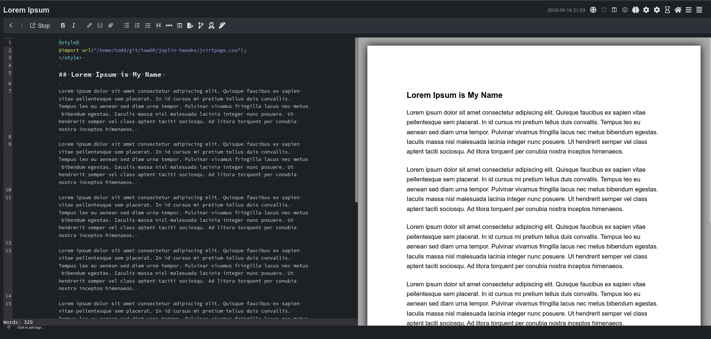
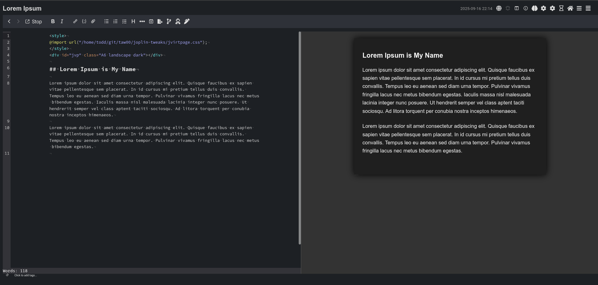

# joplin-tweaks

Style customizations for [Joplin](https://joplinapp.org/), a secure
open-source, notebook application.

Included in this repository are snippets of CSS that customize the look and
feel of the Joplin UI, its markdown previewer, and how documents are presented
in Joplin Cloud.

&ZeroWidthSpace;

### Table of Tweaks

#### Tweaks for the Markdown Previewer & Joplin Cloud

- [jvirtpage.css](#jvirtpagecss) - a Joplin note preview rendered as an
  attractive virtual page ([docs](docs/jvirtpage.md))
- …more tweaks coming…

#### Tweaks for the Joplin UI

- …tweaks coming…

&ZeroWidthSpace;

&ZeroWidthSpace;

# Tweaks for the Markdown Previewer & Joplin Cloud

&ZeroWidthSpace;

## — [jvirtpage.css](jvirtpage.css)

- Preview your document as an aesthetically pleasing virtual page that
  matches international standard dimensions for US Letter, US Half-letter, A4,
  A5, A6 pages. Themeable: default (white page), dim, and dark views.
- Render the document to those dimensions when you export to PDF.
- For more detail, please read:
  https://github.com/taw00/joplin-tweaks/docs/jvirtpage.md

### Quickstart guide to `jvirtpage.css`

1. Download this repository …

`git clone https://github.com/taw00/joplin-tweaks`

2. Install Joplin's "Import Local CSS" plugin and restart

3. Create note in Joplin and add these three lines to the top …

```html
<style>
    @import url("/path/to/joplin-tweaks/jvirtpage.css");
</style>
```

4. Save, and you should see a pretty, virtualized page in the preview pane in
   the Joplin application.

5. Want an A5 landscape virtual page with a dark themed? Add this fourth line
   to your note …

```html
<div id="jvp" class="A5 landscape dark"></div>
```

### Example 1: no customization



### Example 2: dark theme and A6 in a landscape orientation


> ### [IMPORTANT NOTE: Joplin PDF Rendering Bug](https://github.com/laurent22/joplin/issues/13096)
> 
> Joplin 3.4.12 and older disallow exporting to PDF with a different page size
> than what you have set in the joplin settings. That limitation is a bug that
> should be fixed in the next major release.
> https://github.com/laurent22/joplin/issues/13096
>
> **The workaround** is to export to HTML, open that in a browser, then print
> to file (PDF). In a few months—as of this writing (20250916)—this will
> no longer be an issue.

&ZeroWidthSpace;

## — more tweaks coming …

&ZeroWidthSpace;

&ZeroWidthSpace;

# Tweaks for the Joplin UI

&ZeroWidthSpace;

## — tweaks coming …

&ZeroWidthSpace;

&ZeroWidthSpace;

--- 

If you have any questions or concerns, open an issue or email me at t0dd [at]
protonmail [dot] com.

